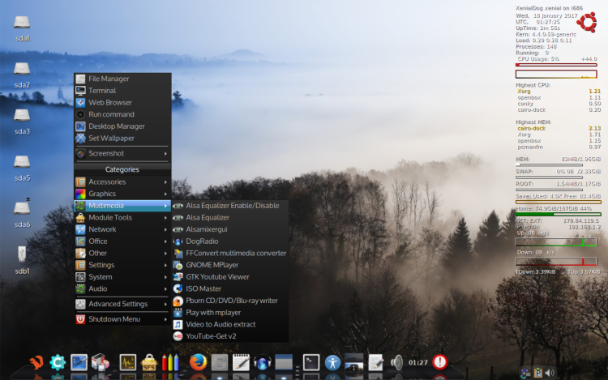
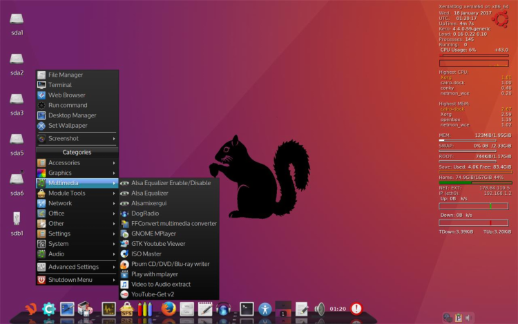

## XenialDog 32 and 64 bit versions   

### (based on Ubuntu 16.04 'Xenial Xerus' LTS)
(Ubuntu minimal "live")  
version 2017-01-22

**XenialDog is a fork of "DebianDog" which is a community project once started by forum member saintless.**   
See also for Debiandog history: [Here](https://debiandog.github.io/doglinux/zz07about.html)   
DebianDog full credits: [Here](https://github.com/DebianDog/Wheezy/blob/master/Credits.md)   

**Update 2017-01-22:**       
ISO's upgraded to version 2017-01-22, below information and download links updated         

[Thread on Puppy Linux forum (32 bit)](http://murga-linux.com/puppy/viewtopic.php?t=106696)   
[Thread on Puppy Linux forum (64 bit)](http://murga-linux.com/puppy/viewtopic.php?t=109476)

**[See here for Changes and Fixes information 32 bit](http://murga-linux.com/puppy/viewtopic.php?p=901549#901549)**      
**[See here for Changes and Fixes information 64 bit](http://murga-linux.com/puppy/viewtopic.php?p=939927#939927)**          

Very similar to DebianDog, but with the difference that it's Ubuntu based

Full access to Ubuntu repositories by using apt-get (from terminal) or from Synaptic Package Manager (GUI)

Openbox is the main window-manager, the GUI setup is very much like [DebianDog Jessie 64-bit](https://debiandog.github.io/doglinux/zz02debiandog64.html)

Differences compared to DebianDog:
    
- Different applications, some are not included and some others added.    
- Choices of window-manager are: Openbox and Jwm , see for specifications below    

#### Login details:    
**root** with password **root**        
**puppy** with password **puppy**    

**Specifications:**    
Built from an absolute minimal Ubuntu full install (using mini.iso).    
Kernel: 4.4.0-59-generic    
Choice of Boot Methods: porteus-boot and casper-boot , see options [Here](https://github.com/DebianDog/xenialdog/wiki)   
Default WM - OpenBox (and option for Jwm, see below)    
(with different choice of Desktop modes: tint2 vertical icons, cairo-dock or rox-pinboard icons, to choose, run 'Desktop Manager' from Menu)    
Tint2 bottom panel or cairo-dock.
(replaced wbar (was in previous 32 bit version) with a minimal cairo-dock       
Default File Manager - pcmanfm with option to use rox.    
Default Internet Browser - Firefox.    
Menu provided by Obmenu-generator (perl script)    
 
Option to switch to JWM (Menu > System > Start Jwm)    

Full LZ4 squashfs support (compression and loading modules)    

Systemd is enabled by default, to use upstart (the older Ubuntu initscripts), do in terminal:
    
```
apt-get update # might be required    
apt-get install upstart-sysv
```    
And reboot    

The Iso size became quite big mainly because:    
- Big size of Ubuntu kernel 4.4.0-59-generic (in /lib/modules)    
- Package 'linux-firmware' installed (has most firmware)        
- Python and Perl installed      

**32 bit:**      
Iso: [XenialDog_32bit-openbox_jwm-2017-01-22-firmware-all.iso](https://github.com/DebianDog/xenialdog/releases/download/v0.1/XenialDog_32bit-openbox_jwm-2017-01-22-firmware-all.iso) **Size: 304MB**        
Md5sum: [XenialDog_32bit-openbox_jwm-2017-01-22-firmware-all.md5](https://github.com/DebianDog/xenialdog/releases/download/v0.1/XenialDog_32bit-openbox_jwm-2017-01-22-firmware-all.md5)   

DEVX: [61-DEVX-XenialDog32-2017-01-18.squashfs](https://github.com/DebianDog/xenialdog/releases/download/v1.0/61-DEVX-XenialDog-2016-05-21.squashfs)    
Locales: [99-locales-XenialDog32-2017-01-18.squashfs](https://github.com/DebianDog/xenialdog/releases/download/v1.0/99-locales-XenialDog-2016-05-21.squashfs)    
      
**64 bit:**   
 Iso: [XenialDog_64bit-openbox_jwm-2017-01-22-firmware-all.iso](https://github.com/DebianDog/xenialdog/releases/download/v0.2/XenialDog_64bit-openbox_jwm-2017-01-22-firmware-all.iso) **Size: 310MB**        
Md5sum: [XenialDog_64bit-openbox_jwm-2017-01-22-firmware-all.md5](https://github.com/DebianDog/xenialdog/releases/download/v0.2/XenialDog_64bit-openbox_jwm-2017-01-22-firmware-all.md5)

DEVX: [61-DEVX-XenialDog64-2017-01-18.squashfs](https://github.com/DebianDog/xenialdog/releases/download/v2.0/61-DEVX-XenialDog-2016-05-21.squashfs)       
Locales: [99-locales-XenialDog64-2017-01-18.squashfs](https://github.com/DebianDog/xenialdog/releases/download/v2.0/99-locales-XenialDog-2016-05-21.squashfs)        

Thanks very much to everyone who has been involved with DebianDog, specially Toni (saintless), William (mcewanw), Terry (sunburnt) and all who helped by giving feedback on the DebianDog threads.

**Screenshots:**      
32 bit OpenBox with cairo-dock      
       
64 bit OpenBox with cairo-dock         
    